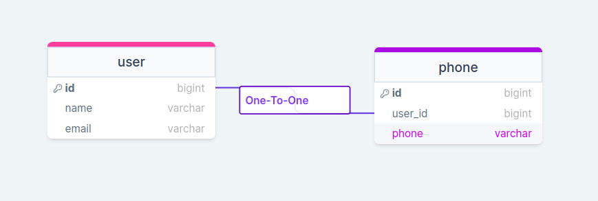

##  [One To One](https://laravel.com/docs/10.x/eloquent-relationships#one-to-one)


```
app/Models/
├── Phone.php
└── User.php
database/
├── database.sqlite
├── factories
│   └── UserFactory.php
├── migrations
│   ├── 2014_10_12_000000_create_users_table.php
│   └── 2024_01_04_164945_create_phones_table.php
└── seeders
    └── DatabaseSeeder.php
routes/
└── web.php
```
