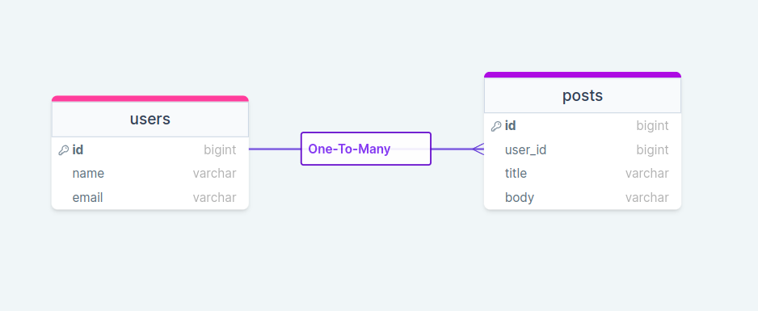

## [One To Many](https://laravel.com/docs/10.x/eloquent-relationships#one-to-many)
## [One To Many (Inverse) / Belongs To](https://laravel.com/docs/10.x/eloquent-relationships#one-to-many-inverse)



## Structure

```
app/Models/
├── Post.php
└── User.php
database/
├── database.sqlite
├── factories
│   └── UserFactory.php
├── migrations
│   ├── 2014_10_12_000000_create_users_table.php
│   └── 2024_01_04_192918_create_posts_table.php
└── seeders
    └── DatabaseSeeder.php
routes
└── web.php
```


## Install and run
```
composer i
```
```
php artisan key:generate
```
```
php artisan migrate
```
```
php artisan db:seed
```
```
php artisan serve
```
```
http://127.0.0.1:8000/one-to-many
```
